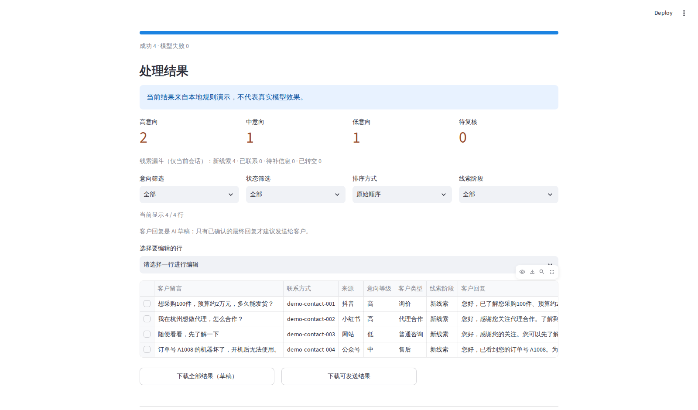
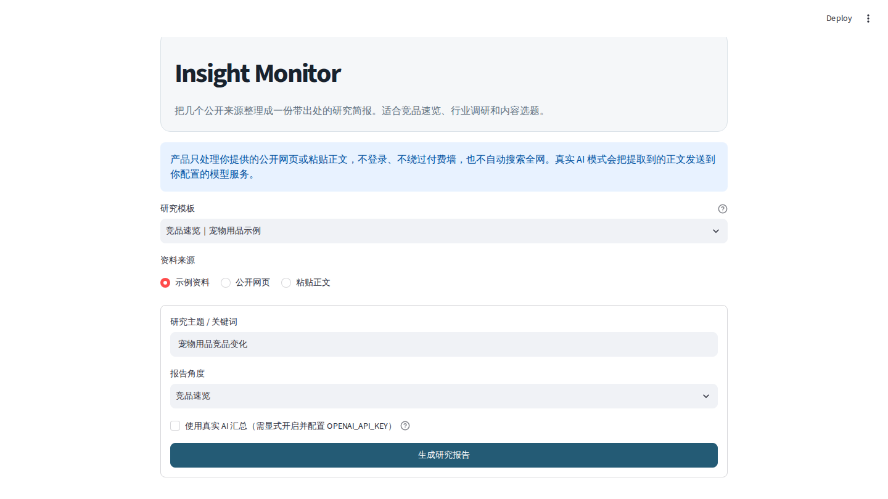

# 把电商询盘表变成可跟进的优先级清单

### Turn customer-message spreadsheets into a prioritized follow-up queue

把 Excel/CSV 中杂乱的客户留言整理成意向等级、客户类型、下一步动作和待人工确认的回复草稿。继续使用现有表格，不必先更换 CRM，也不需要提供店铺密码。

**免费预览：** 3–5 行完全虚构的数据、1 个模板、1 个核心场景，目标 24 小时内返回效果；没有虚构样例时，我会根据列名和规则代为生成。

**完整定制：** ¥299 / US$39 起。

[申请免费样例 / Request a free sample](https://github.com/18228077326zzh-dotcom/-/issues/new?template=free-sample.yml) · [中文演示](assets/demo/ecommerce-lead-automation-zh.mp4) · [English demo](assets/demo/ecommerce-lead-automation-en.mp4) · [完整功能](projects/ecommerce-lead-automation/README.md)

> GitHub Issue 是公开页面。请勿提交姓名、手机号、邮箱、订单号、真实客户文件、密码、Cookie、Token、API Key 或支付信息。

## 你会得到什么 / What you get

| 原始表格 | 处理结果 |
| --- | --- |
| 客户留言、来源、联系方式标识 | 高/中/低意向、客户类型和判断依据 |
| 混在一起的询价、合作和售后咨询 | 可筛选的跟进队列与会话内线索阶段 |
| 需要逐条手写的回复 | 待人工审核的回复草稿和下一步动作 |
| 容易误发的草稿 | 人工确认后才进入“可发送”导出 |

适合仍用 Excel/CSV 手工整理询盘的小商家、跨境电商运营和代运营团队。不适合要求自动登录店铺、无人审核群发、成熟多用户 CRM 或大型数据迁移的项目。

## 免费样例怎么进行 / Free proof of fit

1. 在公开 Issue 中只填写业务类型、虚构列名和一条明确规则。
2. 可附 3–5 行完全虚构的数据；若留空，我会根据列名和规则生成演示数据。
3. 双方确认完整范围、验收项、固定价格和工期。
4. 通过选定的接单平台下单后制作完整定制。

免费样例不包含整批数据、可投入生产的完整工具、源码转让、部署、多轮修改或平台接口。

## 首单套餐 / Introductory packages

| 套餐 | 基础定制 | 标准定制 |
| --- | --- | --- |
| 首单价 | ¥299 / US$39 | ¥499 / US$69 |
| 输入 | 1 个固定 XLSX/CSV 模板 | 1 个固定模板 |
| 范围 | 字段映射、分类、回复草稿、跟进、导出；最多 3 条规则调整 | 完整流程；最多 8 条标签、分类、禁词、语气或导出规则调整 |
| 修改 | 原确认范围内 1 轮 | 原确认范围内 2 轮 |
| 目标工期 | 2 个工作日 | 3–5 个工作日 |

平台 API、账号系统、数据库、托管部署、额外输入格式和长期维护单独评估。公开基础代码采用 MIT License；付费价值是客户字段映射、规则校准、测试、交付和约定范围内的定制，客户专属新增内容的授权在报价前确认。

## 可运行案例 / Working demos

### 1. E-commerce Lead Automation / 电商线索与客服表格自动化

Turn a sanitized Excel/CSV customer-message sheet into an auditable lead queue: intent classification, reply drafts, follow-up actions, session-only funnel stages, human confirmation, and safe workbook export.

把脱敏客户留言表转换成可审核的线索队列：意向分类、回复草稿、跟进动作、会话内漏斗阶段、人工确认和安全 Excel 导出。

- Offline demo; optional OpenAI-compatible provider behind an explicit feature flag
- XLSX/CSV import, common Chinese encodings, formula-injection protection
- Human review separates AI drafts from confirmed, sendable exports
- Funnel stages: new, contacted, awaiting information, handed off
- 117 automated tests at publication time

[Open project README](projects/ecommerce-lead-automation/README.md)



### 2. Other capability: Market Research Brief / 其他能力：竞品研究助手

Convert a small set of public URLs or pasted source texts into an evidence-linked competitor brief, industry weekly, or content-idea report.

把少量公开网页或粘贴资料整理成带原文证据的竞品简报、行业周报或内容选题报告。

- Synthetic templates work without an API key
- Source-by-source evidence, visible failures, Markdown/JSON/project ZIP export
- DNS and redirect SSRF protection plus response-size and timeout limits
- Real AI is disabled by default and requires an explicit deployment flag
- 47 automated tests at publication time

[Open project README](projects/market-research-brief/README.md)



## Run locally / 本地运行

Each project is independent:

```bash
cd projects/ecommerce-lead-automation
python3 -m venv .venv
source .venv/bin/activate
pip install -r requirements.txt
PORT=8501 bash start.sh
```

For the research brief, replace the directory with `projects/market-research-brief`. Both `start.sh` files read `PORT` and bind to `0.0.0.0` for managed deployment.

## Quality and scope / 质量与边界

- Each project includes independent automated tests and Python compilation checks.
- No customer data, live store credentials, API keys, internal logs, or private repository history are included.
- These are portfolio-grade, single-session tools—not claims of production multi-tenant SaaS, guaranteed model accuracy, or guaranteed business outcomes.
- Read [market fit notes](docs/market-fit.md), [delivery boundaries](docs/delivery-boundaries.md), and each project's `SECURITY.md` before adapting them for a client.

## License

Portfolio code is available under the MIT License. Runtime dependencies remain under their own licenses; see the project-level third-party notices.

---

想先确认是否适合你的表格？[申请免费 3–5 行样例 / Request a free sample](https://github.com/18228077326zzh-dotcom/-/issues/new?template=free-sample.yml)。公开 Issue 只接受纯虚构数据；若不方便准备，我会根据列名和规则生成。
